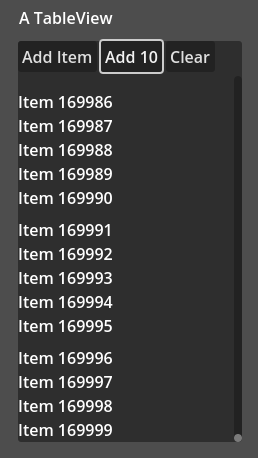

# godot-gds-tableview
iOS API-style table view component

简单的UITableView API风格滚动列表组件，支持单元格复用和动态行高

 

---

## 安装

1. 下载插件文件夹 `addons/gds_tableview4`
2. 复制到项目根目录的 `addons` 文件夹
3. 启用插件：`项目设置 → 插件 → 启用 GDS TableView4`

---

## 基础用法

### 1. 创建数据源

```gdscript
# my_data_source.gd
extends TableViewDataSource

var count: int = 0

func number_of_rows(tableView): 
    return count  # 总行数

func height_for_row_at(tableView, index):
    return 32 if index % 5 == 0 else 24

func cell_for_row_at(tableView, index):
    var cell = tableView.dequeue_reusable_cell("Cell") as Label
    cell.text = "Item %d" % index
    return cell

```

### 2. 设置TableView

```gdscript

func _ready():
    var tableView = $TableView
    tableView.data_source = preload("my_data_source.gd").new()
    tableView.register_cell_scene("Cell", preload("res://Cell.tscn"))

```

### 3. 或者

```gdscript
# my_list_page.gd
extends Control

@onready var table_view: TableView = $TableView

var item_list: Array[String] = ["Item 1", "Item 2", "Item 3"]

func _ready():
    table_view.register_cell_scene("Cell", preload("res://Cell.tscn"))
    table_view.data_source = self
    table_view.rdata_reloaded.connect(table_View_reloaded)


func on_table_View_reloaded(tableView: TableView):
    print("%s reloaded" % tableView.name)


func number_of_rows(tableView: TableView) -> int:
    return item_list.size()


func height_for_row_at(tableView: TableView, index: int) -> float:
    return 32 if index % 5 == 0 else 24
	

func cell_for_row_at(tableView: TableView, index: int) -> Control:
    var cell = tableView.dequeue_reusable_cell("Cell") as Label
    cell.text = item_list[index]
    return cell

```
